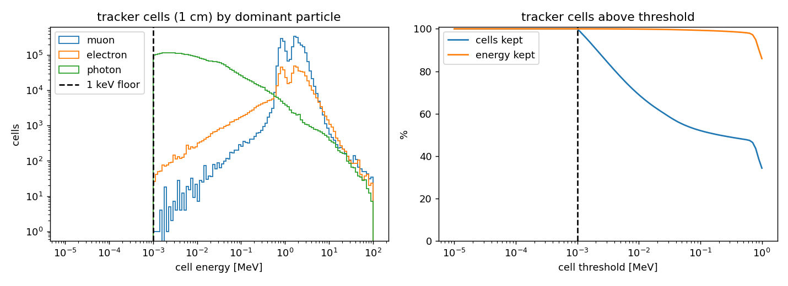
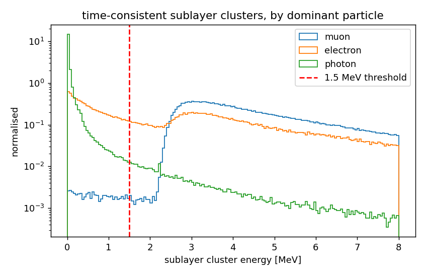
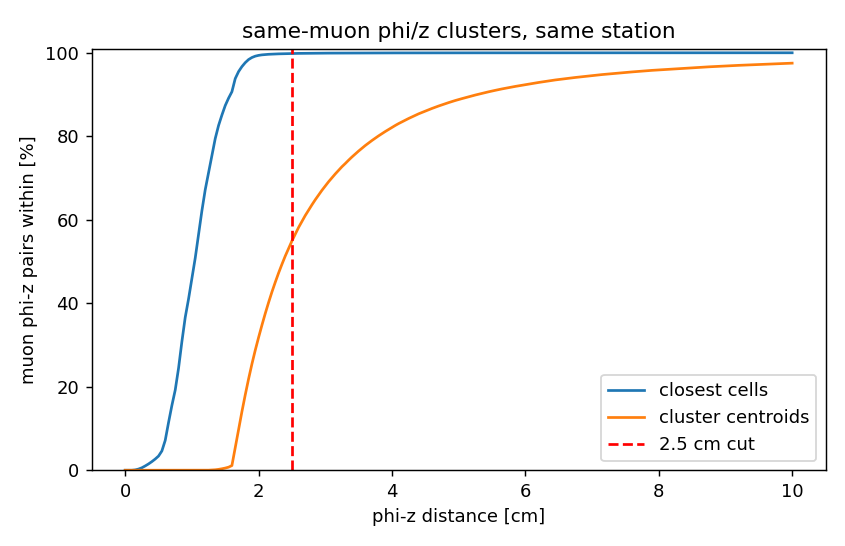
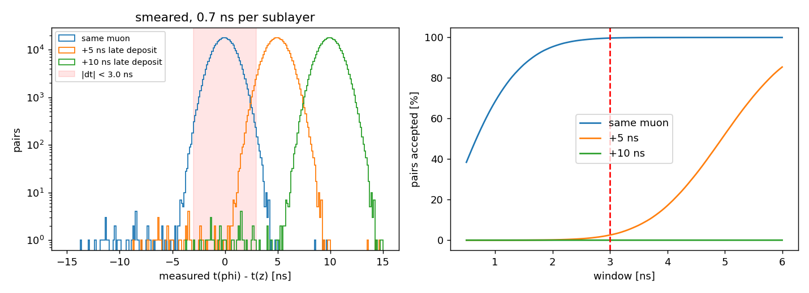
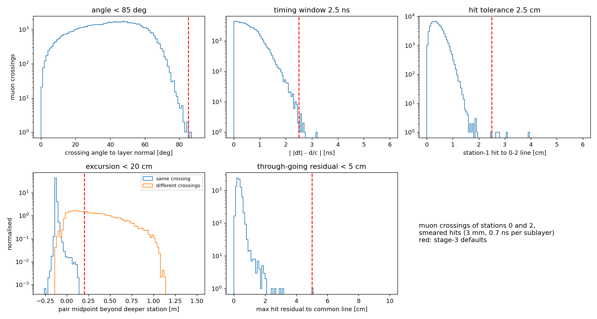
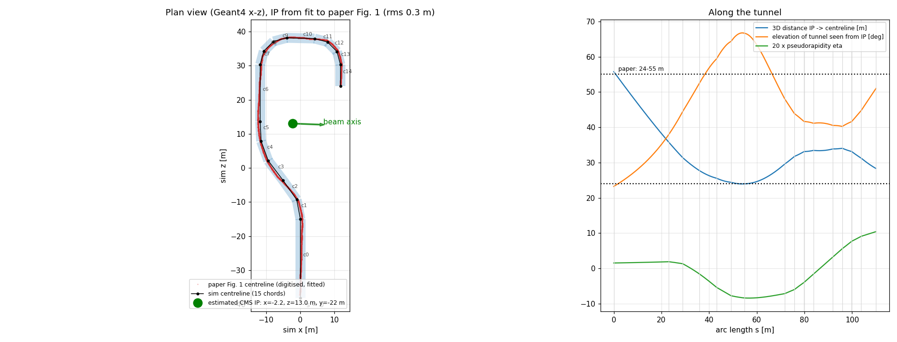

# Cuts and their justification

Every requirement used to build a cell, a tracker hit, a tracklet or a
vertex, with the value, why it is there and the evidence for the value.
Stage-5 selection cuts are listed at the end.

The plots are made by `studies/cut_studies.py` from one stage-1 and one
stage-2 file of the 4M-event cosmic sample (first 100k events of each):

```bash
python3 scripts/studies/cut_studies.py --cells cells_0.root --hits hits_0.root   # writes docs/plots/
```

Every value is a command-line option of its stage, and every output file
records the values it was made with in its `meta` tree.

## Detector assumptions

From the design: 1 cm scintillator bars, time resolution 0.7 ns per
sublayer (0.5 ns per two-sublayer layer), 3 mm position resolution.
Muons are counted as the signal-like reference throughout; electrons and
photons are the backgrounds that the hit cuts should suppress.

---

## Stage 1: cells

| Cut | Value | Option |
|---|---|---|
| Tracker cell size | 1 cm × 1 cm | `--tracker-cell` |
| Veto cell size | 10 cm × 10 cm | `--veto-cell` |
| Minimum cell energy | E > 1 keV | `--min-edep` |
| Contributor listed if | its deposit > 0 | `--min-contrib-edep` |
| Stored precision | 0.1 mm, 1 ps | `--pos-precision`, `--time-precision` |

**Cell size.** In this geometry a volume ID doesn't tell you where a hit
is. Each z sublayer is a single volume along the whole tunnel, and each
~10 cm phi strip uses the same ID in all 15 chords. Stage 1 therefore bins
deposits on a position grid. The grid uses the 1 cm bar width of the
design, so a cell is about one readout channel. Veto scintillators are
used only as yes/no counters, so 10 cm cells are enough.

**1 keV floor.** Each deposit is computed as KE(entry) − KE(exit) in
float32, which leaves rounding residues near zero. The floor drops those
residues and nothing physical. All analysis thresholds are ≥ 100 keV, and
cells above 10 keV already hold 99.87% of the tracker energy
(`stage1_cell_energy.png`, right).



**Bookkeeping check.** The energy of muon-dominated time-consistent
clusters peaks at 3.0 MeV, the expected Landau most-probable value for a
1.5 cm sublayer. This confirms the net-deposit bookkeeping: a particle
created inside a volume has its exit energy subtracted from its parent.

**Precision.** Rounding to 0.1 mm / 1 ps moves values by at most
0.05 mm / 0.5 ps. That is ≥ 30× finer than the detector resolution, and it
cuts the file size by about 17% (see `resources.md`).

---

## Stage 2: tracker hits

| Cut | Value | Option |
|---|---|---|
| Cells in a cluster | touching (edge or corner) in one sublayer | — |
| Cell time consistency | \|t_cell − t_seed\| < 3 ns (true times) | `--dt-match` |
| MIP threshold per sublayer cluster | E ≥ 1.5 MeV | `--cluster-emin` |
| phi–z distance | closest cells < 2.5 cm | `--max-dist` |
| phi–z timing | \|t_phi − t_z\| < 3 ns (smeared times) | `--dt-match` |
| Pairing | one-to-one, closest first | — |
| Time smearing | σ = 0.7 ns per sublayer | `--t-smear` |
| Position smearing | σ = 3 mm along the tunnel and around the arch | `--pos-smear` |
| Veto cell threshold | E > 0.1 MeV | `--veto-emin` |

**Touching cells.** A particle crossing a sublayer at an angle deposits in
neighbouring channels, so touching cells are merged. As a result, two
particles are resolved only if at least one empty 1 cm channel separates
them.

**Cell time consistency.** Without this cut, a deposit arriving
microseconds later in a neighbouring channel would join a prompt muon
cluster and corrupt its energy and time. Cells more than 3 ns from the
cluster's highest-energy cell are split off into their own cluster. The
window is the same as the phi–z window below.

**MIP threshold, 1.5 MeV.** This is half the 3.0 MeV muon peak, below the
Landau edge (about 2.3 MeV). It keeps 99.8% of muon clusters and 2.3% of
photon-dominated clusters (5.0% at 0.5 MeV). Electron-dominated clusters
pass at 66%; most of those are real minimum-ionising electrons, which a
tracker can't distinguish from a muon.



**phi–z distance, closest cells < 2.5 cm.** At normal incidence the phi
and z sublayers are about 1.6 cm apart, and an oblique crossing moves the
two cluster centres further apart (≈ 1.6 cm / cos θ). Measured between
centres, a 2 cm cut keeps only 32% of same-muon pairs (2.5 cm: 55%).
Measuring the distance between the closest cell of each cluster removes
the angle dependence: 2.5 cm keeps 99.8% of same-muon pairs (2 cm: 99.4%).



**phi–z timing, 3 ns on smeared times.** For the same muon, the true
phi–z time difference is below 0.48 ns in 99% of cases and below 1.37 ns in
99.9%. The smeared difference has σ = 0.7·√2 ≈ 1 ns, so the cut is set on
smeared times. The study injects a delay to emulate a late, unrelated
deposit:

| Window | same muon kept | +5 ns late kept | +10 ns late kept |
|---|---|---|---|
| 2.5 ns | 98.7% | 0.7% | 0.01% |
| **3.0 ns** | **99.7%** | **2.5%** | **0.01%** |
| 3.5 ns | 99.9% | 7.4% | 0.01% |



**One-to-one pairing, closest first.** Each cluster belongs to at most one
hit, so one particle can't produce two hits in a station.

**Smearing.** These are the design resolutions. The hit time is the mean of
two sublayer times, which gives 0.49 ns per hit (checked). Truth and
smeared values are both stored, so studies can switch between them. The
smearing is reproducible per event (`smearSeed`; see `outputs.md`).

**Veto threshold, 0.1 MeV.** Carried over from the previous GRENDEL
background analysis. Stage 2 only counts veto cells above threshold per
veto element; the cut on those counts is applied in stage 5.

---

## Stage 3: tracklets

| Cut | Value | Option |
|---|---|---|
| Stations used for finding | 0 and 2 (wall and 24 cm) | `--stations` |
| Crossing angle to the layer normal | < 85° | `--max-angle` |
| Pair timing | \| \|Δt\| − d/c \| < 2.5 ns | `--dt-window` |
| Same-side crossing (midpoint excursion) | ≤ 20 cm beyond the deeper station | `--max-excursion` |
| Hit-to-line distance | < 2.5 cm | `--hit-tol` |
| Hits per tracklet | ≥ 2 | `--min-hits` |
| Through-going partner | common-line residual < 5 cm | `--merge-tol` |
| Time resolution in the χ² | 0.5 ns per hit | `--t-sigma` |

All plotted distributions use muon crossings of stations 0 and 2 with
smeared hits, i.e. what the tracklet finder sees.



**Stations 0 and 2.** This is the two-layer design under study. Stage 2
still forms hits in all four stations and stage 3 keeps them all in its
output, so any other station set can be run without redoing stage 2.

**Crossing angle < 85°.** This bounds the distance allowed between the two
hits of a seed (≤ gap / cos 85°), which keeps the seed search local. Only
1 in 75,000 muon crossings is more oblique.

**Pair timing, 2.5 ns.** Both hits must fit one particle moving at c. The
residual has σ ≈ 0.66 ns and 99.99% of muon crossings are inside 2.5 ns.

**Same-side crossing, 20 cm.** A pair of hits forms a tracklet only if the
straight segment between them stays in the tracker band. The test is
whether the segment's midpoint lies more than 20 cm inward of the deeper
station. Without this rule, hits on opposite sides of the tunnel combine
into spurious tracklets through open air, and in showers they share hits
combinatorially. The cut keeps 100.00% of same-crossing pairs and rejects
84% of pairs from different crossings more than 2 m apart (63% of all
different-crossing pairs). The pairs it doesn't reject are mostly a muon
clipping a corner of the tunnel. For those, the selection below still
picks the two true tracklets, because they cover the same hits with a
shorter total length.

**Hit tolerance, 2.5 cm.** This applies when more than two stations are
used: a hit in another station is attached if it lies within 2.5 cm of the
seed line, and all hits must lie within 2.5 cm of the fitted line. 99.99%
of station-1 hits of muon crossings are within 2.5 cm of the line through
their station-0 and station-2 hits.

**At least 2 hits.** The two-layer design has at most one hit per station,
so 2 is both the minimum and the maximum.

**Selection among overlapping candidates.** A tracklet is one crossing, and
a hit should belong to one tracklet. The finder applies these rules in
order:

1. Drop any candidate whose hits are a subset of another candidate's.
2. Among candidates competing for the same hits, choose the
   non-overlapping set that covers the most hits, then uses the fewest
   tracklets, then has the smallest total length. For example, with two
   hits in each of two stations this picks the two uncrossed tracklets.
3. A hit still unassigned can get the best remaining candidate that
   contains it. Such a tracklet shares hits and is flagged
   `trkl_primary = 0`.

Constructed tests (two parallel muons, a crossed X configuration, and one
muon plus a delta electron) give the intended tracklets. On the full
sample, this selection and the excursion rule together cut the stage-3
runtime from 232 s to 15 s per file.

**Through-going partner, 5 cm.** A muon that crosses the tunnel makes one
tracklet on each side. Two tracklets that share no hits and whose hits lie
within 5 cm of one common line are linked through `trkl_partner`. 99.99%
of muons with two crossings are within 5 cm. No events are removed here;
stage 5 cuts on the link.

**Time χ² (σ = 0.5 ns per hit).** Each tracklet gets the χ² of an outgoing
and of an incoming speed-of-light hypothesis. The sign of the fitted
1/β gives the direction of motion.

---

## Stage 4: vertex

| Rule | Value |
|---|---|
| Events | ≥ 2 tracklets |
| Candidates | every pair of tracklets |
| Best vertex | 1. no shared hits, 2. inside the tunnel (dWall > 0), 3. smallest DCA |

The vertex is the midpoint of the closest approach of the two fitted lines.
Pairs that share hits are almost always two readings of the same crossing,
so they are considered only when nothing else exists. A real decay vertex
is inside the tunnel, so an inside vertex is preferred over a smaller DCA
outside it. No cut is applied in stage 4; every quantity used by the stage-5
selection is stored.

**IP location.** The pointing angle uses the CMS interaction point at
`geometry.IP` = (−2.25, −22.0, 13.03) m. It comes from a rigid fit of the
simulated tunnel centreline to the top view in Fig. 1 of arXiv:2609.00152.
The fit has 0.3 m rms and reproduces the quoted 24–55 m distances and
\|η\| < 0.6. The beam runs approximately along +x.



---

## Stage 5: selection

These values follow the GRENDEL paper's background selection
(arXiv:2609.00152). They are configurable and not re-optimised here. The
cuts apply in this order to the stage-4 file (tracking stations 0 and 2):

| # | Cut | Value | Purpose |
|---|---|---|---|
| 1 | no veto | no veto cell > 0.1 MeV in the floor, lower walls, or the wall extensions of the innermost tracking station | rejects particles from below / the sides |
| 2 | exactly 2 tracklets | | a two-body decay |
| 3 | no free hits | every good hit in the tracking stations is on a tracklet | rejects showers |
| 4 | not through-going | neither tracklet has a partner | rejects muons crossing the tunnel |
| 5 | track timing | outgoing χ²/dof < 3.92 per tracklet | both particles move outward at c; 3.92 is \|Δt − d/c\| < 1.4 ns for two hits of 0.5 ns |
| 6 | separation | 1 cm < inner-station separation < 10 m | two resolved tracks |
| 7 | decay side | vertex inward of both tracklets | tracks start at the vertex |
| 8 | fiducial | vertex inside the innermost tracking station | rejects interactions in the rock |
| 9 | DCA | < 10 cm | tracks meet |
| 10 | vertex dt | \|t1 − t2\| < 1 ns at the vertex | common emission time |
| 11 | parallel | opening angle < 0.1 rad ⇒ outer separation < 30 cm | rejects near-parallel pairs |
| 12 | collinearity | outer separation > 16 cm ⇒ collinearity > 9.6 cm | rejects single straight tracks |
| 13 | pointing | < 50 mrad (outer separation < 10 cm, low mass), else < 800 mrad | points back to the IP |
